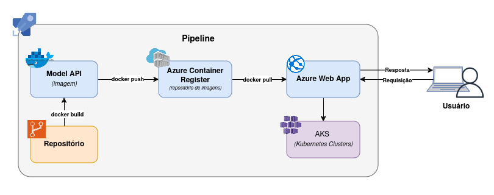

## Case Machine Learning Engineer **🧩**

🎯Objetivo: Criar uma solução de transformação de dados, treino de modelo e escoragem online.

### Estrutura de pastas **📂**

case-picpay
├── docs
│   └── desenho-arquitetura.png
├── notebook
│   ├── mlruns
│   ├── airports-database.csv
│   ├── enriquecimento-base-de-dados.ipynb
│   ├── respostas-base-de-dados.ipynb
│   └── training-model.ipynb
├── src
│   ├── artifacts
│   ├── basemodels.py
│   ├── database.py
│   ├── db_functions.py
│   └── main.py
├── tests
│   └── test_main.py
├── Dockerfile
├── docker-compose.yml
├── pytest.ini
└── requirements.txt

* **docs**: Contém o diagrama de uma possível implementação da arquitetura em cloud.
* **notebook**: Contém os artefatos do modelo logado via mlflow (pasta mlruns), a base de dados utilizada e os notebooks com as soluções pedidas no case.
  * ***respostas-base-de-dados.ipynb***: respostas das 17 perguntas em relação a base de dados, todas processadas com spark;
  * ***enriquecimento-base-de-dados.ipynb***: enriquecimento da base de dados utilizando as APIs weatherbit e airportdb;
  * ***training-model.ipynb***: treinamento do modelo utilizando mlflow.
* **src**: Contém todos os códigos relacionados a API desenvolvida para servir o modelo.
* **tests**: Testes relacionados aos códigos da API.
* **Dockerfile**: Contém todas as instruções para a criação da imagem do container onde a aplicação irá funcionar.
* **docker-compose.yml**: Orquestrador de containers.

### Início rápido 🚀

---

1. Certifique-se de que você possui uma instalação Docker funcionando.
2. Vá na raiz do projeto (ou seja, na raíz de `case-picay`) e rode o comando `docker compose up --build -d`.
3. Faça um teste acessando o Swagger API no endereço `http://localhost/8000/docs`.

### Plano de deploy ⚒️

Arquitetura planejada para  a Azure, mas que pode ser aplicada em outros serviços de cloud equivalentes.
